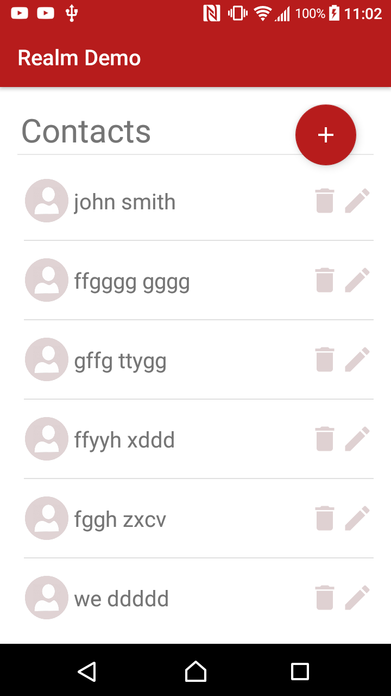
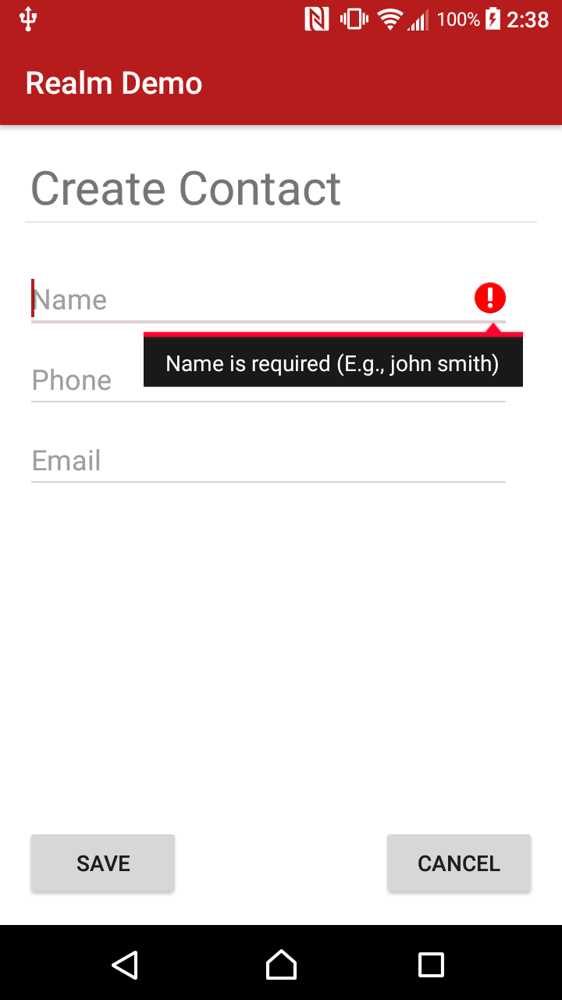

RealmDemo
=========

This demo uses the <a href="https://realm.io/docs/java/latest">Realm Database for Android</a> to manage a list of contacts.
Contacts are displayed in a RecyclerView which uses a RealmRecyclerViewAdapter to automatically syncronize
with any storage operations. The app does basic CRUD (create, read, update, and delete) operations on the contact list. 

  

I'm also using a ConstraintLayout to position all of the view elements.
Written in <b>Java</b> using Android Studio 3.3.2 and tested on Android 7.0.